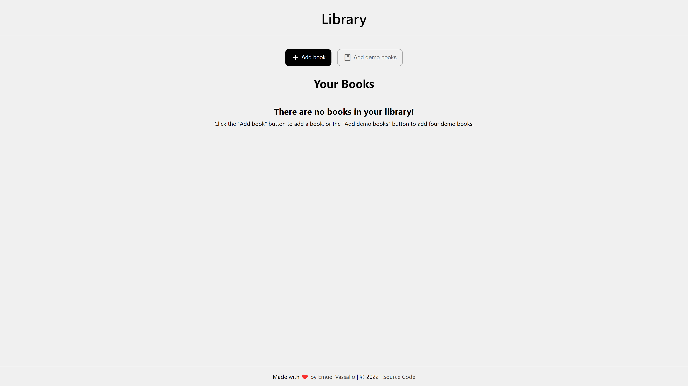
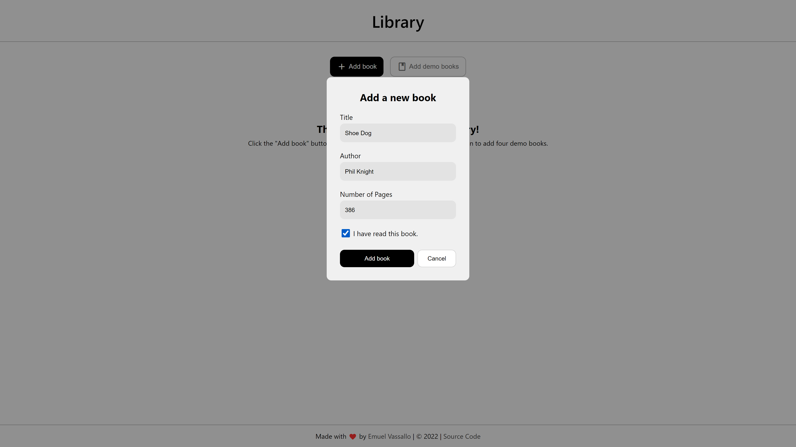
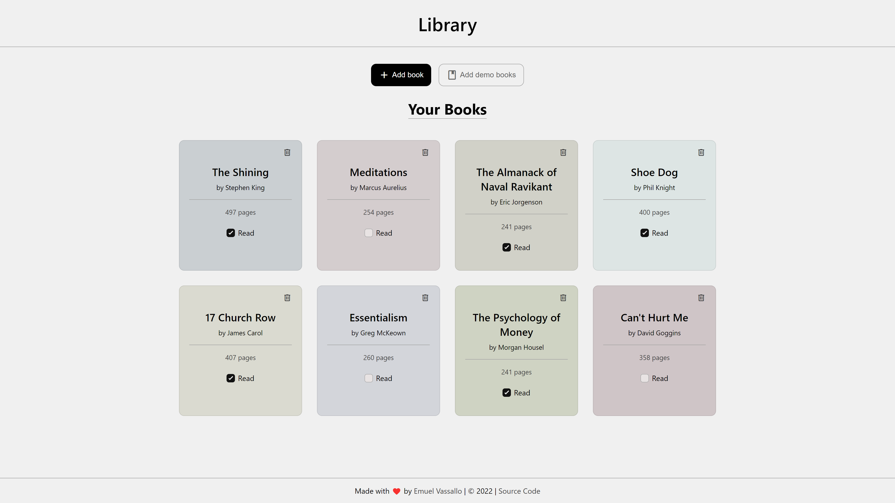

# Library

## Description

A simple library app created as part of The Odin Project's [curriculum](https://www.theodinproject.com/lessons/node-path-javascript-library).

## Showcase

### Empty library message

### Modal

### Displayed books

## Live Demo

👉 **Preview:** https://emuel-vassallo.github.io/library/

## Built With

- HTML
- CSS
- JavaScript

## Lessons Learned

- Appending a container with elements using JavaScript
- Getting a random pastel color and assign it to each book instance
- Removing an item from a grid when clicking a button
- Using form data to create an element that includes it (book)
- Using object constructors and creating instances with it

## Credits and Inspiration

- [Modal popup box tutorial](https://sabe.io/tutorials/how-to-create-modal-popup-box)
- [Monochrome input components](https://dribbble.com/shots/18200426-Inputs-Component) by [Amir Baqian](https://dribbble.com/Amirbaqian)
- [White book favicon](https://icons8.com/icons/set/book-shelf--white) from [icons8.com](https://icons8.com/)
- [Checkbox](https://uiverse.io/detail/adamgiebl/proud-donkey-24) by [@adamgiebl](https://github.com/adamgiebl)
- [Bookly](https://github.com/FrancisLangit/bookly) by [@FrancisLangit](https://github.com/FrancisLangit/)
